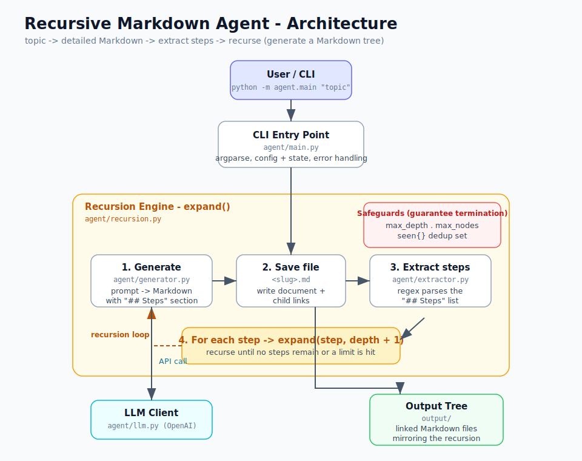

# Design

## Architecture Diagram

## Flow

1. **User / CLI** (`agent/main.py`) — parses the topic and options (`--out`, `--max-depth`, `--max-nodes`), builds the `config` and `state`, and handles API errors gracefully.
2. **Recursion Engine** (`agent/recursion.py` &rarr; `expand()`) drives the loop for each node:
   1. **Generate** (`agent/generator.py`) — prompts the model to produce a Markdown document that includes a `## Steps` section. The LLM call goes through the **LLM Client** (`agent/llm.py`, OpenAI).
   2. **Save** — writes the document to `<slug>.md` and appends links to its children.
   3. **Extract steps** (`agent/extractor.py`) — a regex parses the `## Steps` list into discrete steps.
   4. **Recurse** — calls `expand()` for each step at `depth + 1`.
3. **Safeguards** guarantee termination and cap cost: `max_depth`, `max_nodes`, and a `seen` dedup set.
4. **Output Tree** (`output/`) — a folder of linked Markdown files that mirrors the recursion.

## Why these choices

- **Strict prompt contract + regex extraction** keeps step parsing deterministic and avoids a second LLM call.
- **Lazy LLM client** means the API key is only required at call time, so `--help` and tests run without one.
- **Bounded recursion** (depth / node budget / dedup) prevents the model from inventing sub-steps forever.
